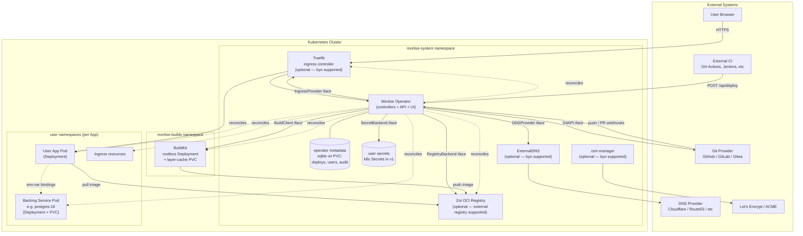
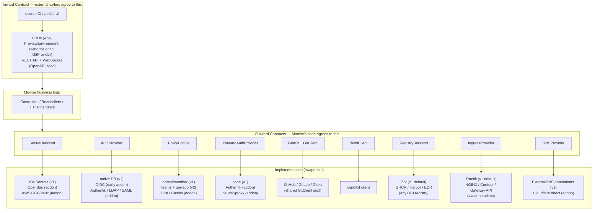
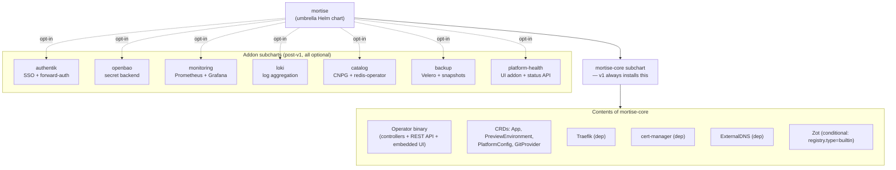
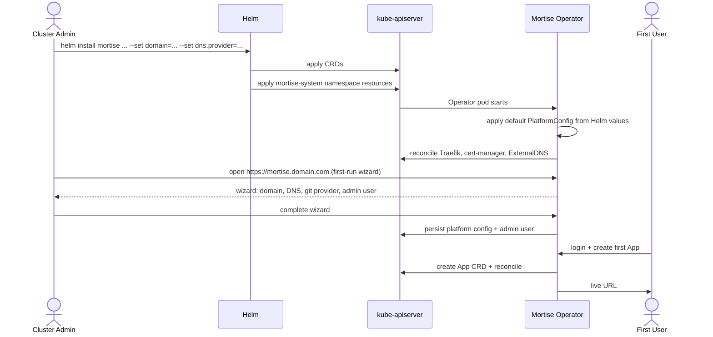

# Mortise — Architecture & System Diagrams

> Companion to [`SPEC.md`](./SPEC.md). Diagrams render natively on GitHub via
> Mermaid. For each diagram: the picture first, then a short "how to read it."

---

## 1. System Component Architecture

The full orchestration layer: external systems, the Mortise operator, the
platform components it manages, and the user workloads it reconciles.



**How to read it:**

- **Solid arrows** = live runtime traffic (HTTP, webhooks, API calls, image pulls).
- **Dotted arrows** = the operator reconciling a resource (creating / updating /
  deleting Kubernetes objects based on CRD state).
- **Named arrows** (`GitProvider iface`, `BuildClient iface`, etc.) cross one of
  the outward interface seams defined in SPEC §11. Everything the operator does
  *outside* the Kubernetes API goes through one of these contracts.
- **Namespaces** are the ownership boundary. `mortise-system` is the platform
  itself; `mortise-builds` is isolated so build pods can't interfere with user
  workloads; each user App gets its own namespace with its own Deployments,
  Services, Ingresses, and PVCs.
- **Bindings** (bottom dotted arrow): resolved by the operator at reconcile
  time and baked into the binder's Deployment spec (literal env for Service
  DNS facts; `secretKeyRef` for credentials from the secret backend). The
  kubelet injects env the normal way at pod start — no admission webhook, no
  init container, no runtime agent. Apps are 12-factor — they just read
  `DATABASE_URL`.
- **Two datastores in `mortise-system`, deliberately separate:** `MetaDB`
  (sqlite-on-PVC) holds Mortise's own metadata (deploy history, users,
  audit). `SecretStore` holds user-visible app secrets behind the
  `SecretBackend` interface (v1 backend = k8s Secrets). Keeping them split
  means swapping the secret backend for OpenBao / AWS SM never migrates
  Mortise's operational data.
- **"Optional" labels** on Traefik, cert-manager, ExternalDNS, Zot: each
  corresponds to an outward interface (`IngressProvider`, `DNSProvider`,
  `RegistryBackend`) and can be turned off at install via chart values when
  the cluster already has the component. See SPEC §8.3.

### Component Roles & Scopes

| Component | Namespace | Role | Scope boundary |
|---|---|---|---|
| **Mortise Operator** | `mortise-system` | Reconciles CRDs (`App`, `PreviewEnvironment`, `PlatformConfig`, `GitProvider`). Serves the REST API and UI. Handles webhooks. Owns everything the platform creates. | Never touches resources outside what it created; coexists with Argo CD, manual kubectl, other tools. |
| **Operator datastore** | `mortise-system` | Stores deploy history, users (v1 native auth), audit logs, session tokens. v1 = sqlite on PVC; v2 = Postgres for HA. | Never stores user app data — only Mortise metadata. |
| **Traefik** | `mortise-system` | Ingress controller. Routes external HTTPS traffic to user Apps and the Mortise API/UI. | Installed and managed by core chart. Addon pack may add forward-auth middleware for per-App SSO. |
| **cert-manager** | `mortise-system` | Issues TLS certs via ACME (or self-signed in dev/test). Triggered by annotations on Ingress resources. | Core chart dependency; not touched by user. |
| **ExternalDNS** | `mortise-system` | Watches Ingress resources and creates matching DNS records at the configured provider. | Core chart dependency; configured once during install. |
| **Zot** | `mortise-system` | OCI image registry. Default target for builds unless external registry configured. | Installed conditionally (omitted if user picks GHCR/Docker Hub/custom). |
| **BuildKit** | `mortise-builds` | Builds container images from git sources. Consumes LLB or Dockerfile input; pushes to registry. | Installed lazily on first git App. Addon pack later adds pooling. |
| **User App pods** | `<app-ns>` | The actual workloads Mortise deploys. | Pure 12-factor; no Mortise SDK or sidecar required. |
| **Backing service pods** | `<app-ns>` | Apps with `credentials:` declared — typically stateful (Postgres, Redis). Other Apps bind to them. | v1 = `image` source + PVC + manual credentials. Addon pack adds operator-backed `catalog` source for HA/PITR. |

---

## 2. Deploy Flow (Git Push → Live URL)

Time-ordered sequence for the `git` source hot path. The `image` source path
skips the build phase entirely.

```mermaid
sequenceDiagram
    actor Dev as Developer
    participant Git as GitHub / GitLab / Gitea
    participant Op as Mortise Operator
    participant BK as BuildKit
    participant Reg as Zot Registry
    participant K8s as kube-apiserver
    participant Pod as App Pod
    participant TF as Traefik

    Dev->>Git: git push
    Git->>Op: webhook: push event (HMAC-signed)
    Op->>Op: resolve GitProvider + verify HMAC (GitAPI iface)
    Op->>Op: list Apps on this repo;<br/>for each, compare changed paths<br/>to watchPaths prefixes
    Note over Op: one webhook → N concurrent<br/>per-App build pipelines

    loop per matched App
        Op->>Git: clone repo (GitClient iface)
        Op->>Op: detect Dockerfile vs Railpack mode
    end

    alt Dockerfile mode
        Op->>BK: Submit dockerfile.v0 frontend
    else Railpack mode
        Op->>Op: Railpack.GenerateBuildPlan<br/>ConvertPlanToLLB
        Op->>BK: Submit LLB
    end

    BK->>Reg: push image layers
    BK-->>Op: stream build events
    Op-->>Dev: build logs via WebSocket (UI)

    alt build succeeds
        Op->>K8s: patch Deployment image digest
        K8s->>Pod: rolling update
        Pod->>Reg: pull new image
        Op->>Git: post commit status: success
    else build fails
        Op->>Git: post commit status: failure
        Op-->>Dev: error surfaced in UI
    end

    Dev->>TF: HTTPS GET app.domain.com
    TF->>Pod: route (matched by Ingress)
    Pod-->>Dev: HTTP response
```

**How to read it:**

- **Top half** = the build and deploy reaction to a push.
- **Bottom line** = the steady-state user traffic (Traefik handles this
  independently of the operator — the operator is not in the request path).
- **Preview PRs** follow the same shape, plus the operator creates a
  `PreviewEnvironment` CR at PR-open and deletes it at PR-close.
- **External CI** skips everything down to "patch Deployment" — the deploy
  webhook jumps straight there, providing a pre-built image digest.

---

## 3. Interface Contracts (Visual of SPEC §11)

The two-layer contract model as a picture. Read top to bottom.



**How to read it:**

- **Top block (Inward)** = what the outside world sees. Versioned carefully;
  breaking changes require CRD version bumps and migrations.
- **Middle block (Business logic)** = Mortise's controllers. Imports only
  Mortise's own types. Never imports third-party SDKs.
- **Bottom two blocks (Outward + Impls)** = internal plumbing. Completely
  invisible from outside the codebase. The controllers call an interface; the
  concrete implementation behind it can change without touching controller
  code. This is how the addon pack swaps in OpenBao later without rewriting
  the reconcile loops.

---

## 4. Install & Chart Layout

What actually lands on a cluster during install, and where the addon pack
attaches later.



**How to read it:**

- **Solid arrows** = always installed when the umbrella chart is installed.
  The `mortise-core` subchart is the v1 footprint.
- **Dotted arrows** = opt-in. Each addon is its own subchart with its own
  values; the umbrella chart declares them as disabled-by-default dependencies
  so users can turn them on with a values flag (or via the CLI picker later).
- **BuildKit is intentionally absent** from the core subchart. It's installed
  on-demand by the operator the first time a `git` App is created — not at
  chart install time. Keeps the base install lean for users who only deploy
  images.
- **User app namespaces** are not in this diagram because they're not part of
  the chart. They're created dynamically by the operator when an App is
  deployed.

### Install Flow (v1)



---

## 5. Data Flow Summary

One-line-per-arrow summary of every major data flow, useful as a reference
when reading the code or debugging a specific interaction.

| From | To | Via | Purpose |
|---|---|---|---|
| User browser | Traefik | HTTPS | User traffic to deployed apps + Mortise UI/API |
| Git provider | Operator | HTTPS webhook | Push / PR events trigger build + preview lifecycle |
| External CI | Operator | HTTPS + bearer token | Deploy pre-built image without Mortise building it |
| Operator | Git provider | `GitProvider` iface | Webhook registration, clone, commit status |
| Operator | BuildKit | `BuildClient` iface (gRPC) | Submit build; receive streaming events |
| Operator | SecretBackend | `SecretBackend` iface | Read/write secret values |
| Operator | kube-apiserver | controller-runtime client | Reconcile Deployments, Services, Ingresses, PVCs |
| BuildKit | Zot (or external registry) | OCI push | Store built images |
| User App pod | Zot (or external) | OCI pull | Start with the built image |
| ExternalDNS | DNS provider API | HTTPS | Create/delete DNS records from Ingress annotations |
| cert-manager | ACME server | HTTPS (ACME protocol) | Provision TLS certs for Ingress hostnames |
| User App pod | Backing service pod | Cluster DNS (Service) + env vars | Runtime consumption of bindings (env resolved at reconcile time, baked into Deployment spec) |
| Operator | User browser | WebSocket | Stream build logs and App status to UI |
| Operator | Registry | `RegistryBackend` iface | Image naming, tag listing, GC |
| Operator | Ingress controller | `IngressProvider` iface | Pick ingress class, set provider-specific annotations |
| Operator | AuthProvider | `AuthProvider` iface | Platform auth (UI/API login) |
| Operator | PolicyEngine | `PolicyEngine` iface | Who can do what on which App |

---

## 6. What This Does Not Show

- **Multi-cluster topology** — out of scope for v1; a future Cluster CRD
  layers on top of this diagram with zero changes to the single-cluster
  picture.
- **Addon pack detailed internals** — each addon subchart has its own
  component diagram; will be drawn when those land.
- **CI pipeline for Mortise itself** — GitHub Actions running `make test`
  and `make test-integration`; covered in SPEC §7.
- **RBAC and service account details** — operator has cluster-wide read
  across CRDs + write within namespaces it creates; detailed RBAC manifest
  lives in the chart, not in this overview.
