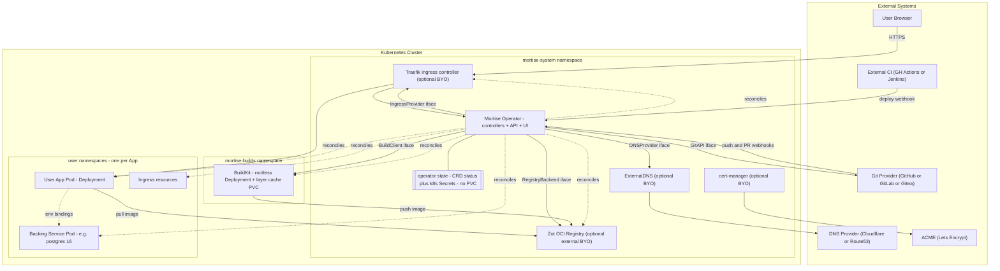
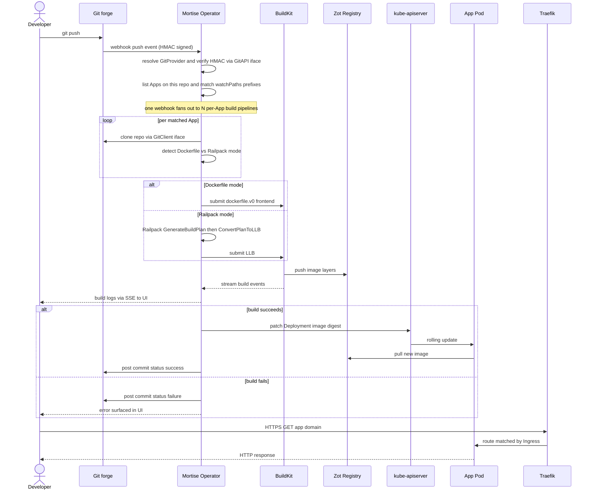
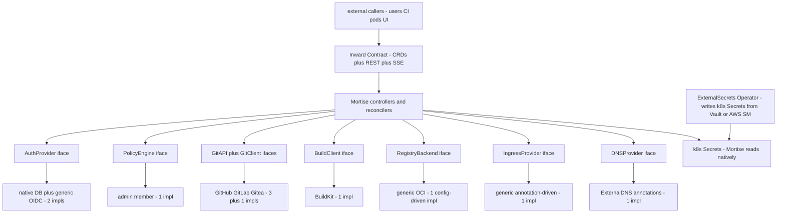
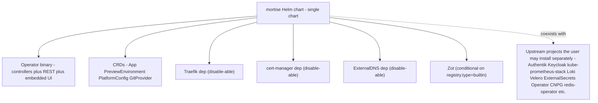
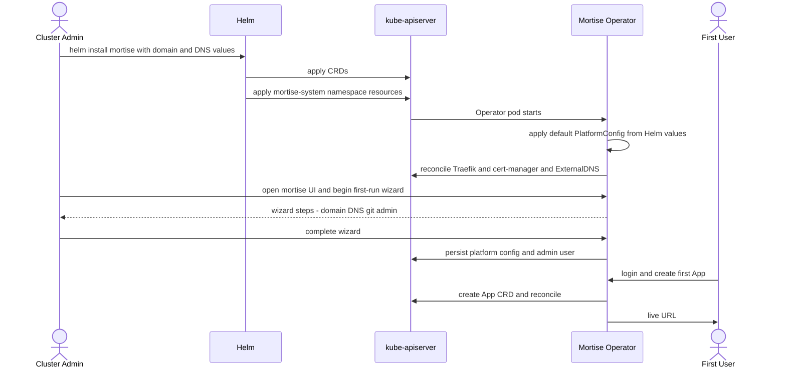

# Mortise — Architecture & System Diagrams

> Companion to [`SPEC.md`](./SPEC.md). Diagrams render natively on GitHub via
> Mermaid. For each diagram: the picture first, then a short "how to read it."

---

## 1. System Component Architecture

The full orchestration layer: external systems, the Mortise operator, the
platform components it manages, and the user workloads it reconciles.

**How to read it:**

- **Solid arrows** = live runtime traffic (HTTP, webhooks, API calls, image pulls).
- **Dotted arrows** = the operator reconciling a resource (creating / updating /
  deleting Kubernetes objects based on CRD state).
- **Named arrows** (`GitProvider iface`, `BuildClient iface`, etc.) cross one of
  the outward interface seams defined in SPEC §11. Everything the operator does
  *outside* the Kubernetes API goes through one of these contracts.
- **Namespaces** are the ownership boundary. `mortise-system` is the platform
  itself; `mortise-builds` is isolated so build pods can't interfere with user
  workloads; each user App gets its own namespace with its own Deployments,
  Services, Ingresses, and PVCs.
- **Bindings** (bottom dotted arrow): resolved by the operator at reconcile
  time and baked into the binder's Deployment spec (literal env for Service
  DNS facts; `secretKeyRef` for credentials pulled from k8s Secrets). The
  kubelet injects env the normal way at pod start — no admission webhook, no
  init container, no runtime agent. Apps are 12-factor — they just read
  `DATABASE_URL`.
- **No external datastore.** The operator is stateless — deploy history
  lives in App CRD status (bounded list), users and sessions are k8s
  Secrets in `mortise-system`, audit events are structured JSON on stdout.
  No PVC, no database. User-visible app
  secrets are stored as regular Kubernetes Secrets in the App's own
  namespace — no separate Mortise-managed secret store, no `SecretBackend`
  abstraction. External secret managers (Vault, AWS SM, etc.) integrate via
  the ExternalSecrets Operator, which produces k8s Secrets that Mortise
  reads like any other. See SPEC §5.9.
- **"Optional" labels** on Traefik, cert-manager, ExternalDNS, Zot: each
  corresponds to an outward interface (`IngressProvider`, `DNSProvider`,
  `RegistryBackend`) and can be turned off at install via chart values when
  the cluster already has the component. See SPEC §8.3.

### Component Roles & Scopes

| Component | Namespace | Role | Scope boundary |
|---|---|---|---|
| **Mortise Operator** | `mortise-system` | Reconciles CRDs (`App`, `PreviewEnvironment`, `PlatformConfig`, `GitProvider`, `Team`). Serves the REST API and UI. Handles webhooks. Owns everything the platform creates. | Never touches resources outside what it created; coexists with Argo CD, manual kubectl, other tools. |
| **Operator state** | `mortise-system` | Deploy history in App CRD status; users/sessions as k8s Secrets; audit/build logs to stdout. No PVC, no database — operator is stateless. | Never stores user app data. |
| **Traefik** | `mortise-system` | Ingress controller. Routes external HTTPS traffic to user Apps and the Mortise API/UI. | Installed and managed by the Mortise chart; can be disabled when the cluster has an existing controller (SPEC §8.3). |
| **cert-manager** | `mortise-system` | Issues TLS certs via ACME (or self-signed in dev/test). Triggered by annotations on Ingress resources. | Core chart dependency; not touched by user. |
| **ExternalDNS** | `mortise-system` | Watches Ingress resources and creates matching DNS records at the configured provider. | Core chart dependency; configured once during install. |
| **Zot** | `mortise-system` | OCI image registry. Default target for builds unless external registry configured. | Installed conditionally (omitted if user picks GHCR/Docker Hub/custom). |
| **BuildKit** | `mortise-builds` | Builds container images from git sources. Consumes LLB or Dockerfile input; pushes to registry. | Installed lazily on first git App. Pooling / scale-out is post-v1 operator work if queue wait becomes a problem. |
| **User App pods** | `<app-ns>` | The actual workloads Mortise deploys. | Pure 12-factor; no Mortise SDK or sidecar required. |
| **Backing service pods** | `<app-ns>` | Apps with `credentials:` declared — typically stateful (Postgres, Redis). Other Apps bind to them. | v1 = `image` source + PVC + manual credentials. Users who need HA/PITR install CNPG or redis-operator directly and point Apps at them (SPEC §6.3). |

---

## 2. Deploy Flow (Git Push → Live URL)

Time-ordered sequence for the `git` source hot path. The `image` source path
skips the build phase entirely.

**How to read it:**

- **Top half** = the build and deploy reaction to a push.
- **Bottom line** = the steady-state user traffic (Traefik handles this
  independently of the operator — the operator is not in the request path).
- **Preview PRs** follow the same shape, plus the operator creates a
  `PreviewEnvironment` CR at PR-open and deletes it at PR-close.
- **External CI** skips everything down to "patch Deployment" — the deploy
  webhook jumps straight there, providing a pre-built image digest.

---

## 3. Interface Contracts (Visual of SPEC §11)

The two-layer contract model as a picture. Read top to bottom.

**How to read it:**

- **Top** (Callers → Public → Ctrl) = the inward contract surface. CRDs,
  REST API, and SSE — versioned carefully; breaking changes require
  CRD version bumps and migrations.
- **Ctrl node** = Mortise's controllers and reconcilers. Imports only
  Mortise's own types; never imports third-party SDKs directly.
- **Middle chains** (Ctrl → each iface → impl) = internal abstractions.
  Go interfaces used for test seams and for keeping third-party SDKs out
  of controller code. **Not plug-in APIs** — third parties do not implement
  these. ~11 in-tree impls total across all contracts.
- **Bottom path** (Ctrl → k8s Secrets ← ESO) = the real third-party
  integration path. External secret managers reach Mortise through
  ExternalSecrets Operator, which writes a standard k8s Secret that
  Mortise reads natively. No Mortise-specific contract is crossed;
  Kubernetes is the protocol.
- **No `SecretBackend` interface.** Mortise reads k8s Secrets directly.
  Custom ingress controllers, alternative DNS providers, monitoring
  stacks, and policy engines all follow the same pattern: they integrate
  with Mortise by being Kubernetes citizens, not by implementing Mortise
  contracts.

---

## 4. Install & Chart Layout

What lands on a cluster during install. One chart, no addon subcharts, no
umbrella. Adjacent capabilities (OIDC, monitoring, logs, backups, external
secret managers) are upstream projects the user installs themselves — they
do not go through this chart.

**How to read it:**

- **Solid arrows** = always installed when the Mortise chart is installed.
  This is the whole product — §6.1 invariant #1.
- **"disable-able" deps** = Traefik, cert-manager, ExternalDNS are bundled
  for a one-command install but can each be turned off when the cluster
  already has them (SPEC §8.3). Disabling swaps the implementation; the
  feature stays.
- **Dotted "coexists with" edge** = everything off to the right is an
  upstream project the user installs themselves using its own chart.
  Mortise does not package, vendor, or wrap them. Integration is through
  standard Kubernetes primitives: ESO writes k8s Secrets; Prometheus
  scrapes pods; Velero snapshots namespaces; an OIDC provider exposes an
  `issuerURL`. None of these require code in Mortise.
- **Not in the chart either:** the `external` / `helm` source types and
  Cloudflare Tunnel automation are post-v1 operator features (SPEC §6.2) —
  they add code to the same operator binary, not new subcharts. App preset
  repositories are data, not code (SPEC §6.5).
- **BuildKit is intentionally absent.** It's installed on-demand by the
  operator the first time a `git` App is created — not at chart install
  time. Keeps the base install lean for image-only users.
- **User app namespaces** are not in this diagram because they're not part
  of the chart. They're created dynamically by the operator when an App is
  deployed.

### Install Flow (v1)

---

## 5. Data Flow Summary

One-line-per-arrow summary of every major data flow, useful as a reference
when reading the code or debugging a specific interaction.

| From | To | Via | Purpose |
|---|---|---|---|
| User browser | Traefik | HTTPS | User traffic to deployed apps + Mortise UI/API |
| Git provider | Operator | HTTPS webhook | Push / PR events trigger build + preview lifecycle |
| External CI | Operator | HTTPS + bearer token | Deploy pre-built image without Mortise building it |
| Operator | Git provider | `GitProvider` iface | Webhook registration, clone, commit status |
| Operator | BuildKit | `BuildClient` iface (gRPC) | Submit build; receive streaming events |
| Operator | k8s Secret | native read/write | User-visible app secrets (stored as k8s Secrets in App namespace) |
| ExternalSecrets Operator | k8s Secret | ESO reconciliation | External secret manager values (Vault / AWS SM / etc.) surface as k8s Secrets; Mortise reads them unchanged |
| Operator | kube-apiserver | controller-runtime client | Reconcile Deployments, Services, Ingresses, PVCs |
| BuildKit | Zot (or external registry) | OCI push | Store built images |
| User App pod | Zot (or external) | OCI pull | Start with the built image |
| ExternalDNS | DNS provider API | HTTPS | Create/delete DNS records from Ingress annotations |
| cert-manager | ACME server | HTTPS (ACME protocol) | Provision TLS certs for Ingress hostnames |
| User App pod | Backing service pod | Cluster DNS (Service) + env vars | Runtime consumption of bindings (env resolved at reconcile time, baked into Deployment spec) |
| Operator | User browser | SSE (text/event-stream) | Stream build logs, deploy status, and live app logs to UI |
| Operator | Registry | `RegistryBackend` iface | Image naming, tag listing, GC |
| Operator | Ingress controller | `IngressProvider` iface | Pick ingress class, set provider-specific annotations |
| Operator | AuthProvider | `AuthProvider` iface | Platform auth (UI/API login) |
| Operator | PolicyEngine | `PolicyEngine` iface | Who can do what on which App |

---

## 6. What This Does Not Show

- **Multi-cluster topology** — out of scope for v1; a future Cluster CRD
  layers on top of this diagram with zero changes to the single-cluster
  picture.
- **Upstream projects users install alongside Mortise** (Authentik,
  Prometheus, Loki, Velero, ESO, CNPG, etc.) — those each have their own
  docs and architecture; Mortise coexists with them through standard
  Kubernetes primitives (see SPEC §6.3) and does not wrap them.
- **CI pipeline for Mortise itself** — GitHub Actions running `make test`
  and `make test-integration`; covered in SPEC §7.
- **RBAC and service account details** — operator has cluster-wide read
  across CRDs + write within namespaces it creates; detailed RBAC manifest
  lives in the chart, not in this overview.
