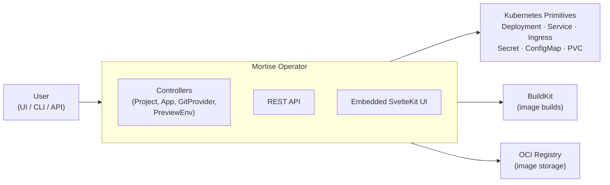

# Mortise

**Self-hosted, Railway-style deploy platform for Kubernetes.**

[](https://github.com/mortise-org/mortise/actions/workflows/ci.yml)
[](https://github.com/mortise-org/mortise/releases/latest)
[](https://github.com/mortise-org/mortise#install)
[](LICENSE)

Connect a git repo or pick a pre-built image - Mortise handles builds, deploys, domains, TLS, environment variables, volumes, preview environments, and service bindings. Kubernetes stays out of your way, but remains fully extensible.

---

## Install

<details>
<summary><b>Quick install (no cluster yet)</b></summary>

One command. Provisions k3s on Linux or k3d on macOS/Windows, helm-installs the full stack, and opens the UI on `localhost:8090`.

**macOS** (requires Docker Desktop)
```bash
curl -fsSL https://mortise.me/install | bash
```

**Linux** (requires sudo - installs k3s natively)
```bash
curl -fsSL https://mortise.me/install | bash
```

**Windows 10+** (requires Docker Desktop)
```powershell
iwr -useb https://mortise.me/install.ps1 | iex
```

See [scripts/README.md](scripts/README.md) for installer details and override variables.

</details>

<details>
<summary><b>Helm (existing cluster)</b></summary>

The `mortise` chart is batteries-included: operator + Traefik + cert-manager + BuildKit + OCI registry.

```bash
helm repo add mortise https://mortise-org.github.io/mortise
helm repo update

helm install mortise mortise/mortise \
  --namespace mortise-system \
  --create-namespace
```

Traefik is the default ingress controller but is not a hard requirement. To bring your own:

```bash
helm install mortise mortise/mortise \
  --namespace mortise-system --create-namespace \
  --set traefik.enabled=false \
  --set mortise-core.operator.ingressClassName=<your-class>
```

Full values reference, upgrade, and uninstall: **[docs/install.md](docs/install.md)**

</details>

<details>
<summary><b>Operator-only (BYO ingress, cert-manager, registry, BuildKit)</b></summary>

Use `mortise-core` when you already have a stack and only want the Mortise operator:

```bash
helm install mortise mortise/mortise-core \
  --namespace mortise-system \
  --create-namespace
```

</details>

After installing, follow the **[Quickstart](docs/quickstart.md)** to create an admin account and deploy your first app.

---

## What's Included

| Component | Purpose |
|-----------|---------|
| **Operator** | Kubernetes controller that reconciles `App`, `Project`, `GitProvider`, `PreviewEnvironment` CRDs |
| **REST API** | Project, app, env var, deploy, rollback, and domain management |
| **SvelteKit UI** | Canvas-based dashboard, app drawer, env var editor, project settings - embedded in the operator binary |
| **CLI** | `mortise login`, `mortise app create`, `mortise deploy`, `mortise env` |
| **Helm Charts** | `mortise` (batteries-included) and `mortise-core` (operator-only) |

---

## Features

- **Git-source deploys** - connect GitHub, GitLab, or Gitea; auto-build via Railpack or Dockerfile
- **Image deploys** - deploy any container image directly
- **Docker Compose templates** - one-click Supabase stack (6 services) or bring your own Compose file
- **Environment variables** - Secret-backed storage, masked values, source badges, multi-line paste, raw editor
- **Project variables** - project-level vars shared across all apps in a project
- **Service bindings** - bind apps to backing services, auto-inject `DATABASE_HOST`, `DATABASE_PORT`, `DATABASE_URL`
- **Auto-domain routing** - public apps get `{app}.{platformDomain}` automatically with TLS
- **Per-environment namespaces** - production, staging, and preview environments each get an isolated k8s namespace
- **Preview environments** - PR-driven ephemeral deploys for git-source apps
- **CrashLoop detection** - surfaces pod crash reasons directly in the UI
- **GitHub device flow** - one-click git provider connection from the settings page

---

## Architecture

One operator, one Helm chart. No addons, no plug-in protocol.



External capabilities (OIDC, monitoring, backups, external secrets) plug in through standard Kubernetes primitives - Mortise coexists with Argo CD, Flux, ESO, and other operators.

See [ARCHITECTURE.md](ARCHITECTURE.md) for full system diagrams.

---

## Docs

**For users:**

| Doc | Purpose |
|-----|---------|
| [Quickstart](docs/quickstart.md) | Zero to deployed app in 10 minutes |
| [Install](docs/install.md) | Helm install, values reference, upgrade, uninstall |
| [Cluster setup](docs/cluster-setup.md) | Getting a cluster running (k3d, k3s, EKS, GKE, AKS) |
| [Configuration](docs/configuration.md) | Domain, git providers, HTTPS, storage, environments |
| [API quickstart](docs/api-quickstart.md) | End-to-end API workflow with curl |
| [OpenAPI spec](docs/swagger.yaml) | Full API reference - open in [Swagger Editor](https://editor.swagger.io) or [Stoplight](https://stoplight.io) |
| [Systems overview](docs/systems-overview.md) | Runtime architecture, controllers, and reconciliation |
| [Troubleshooting](docs/troubleshooting.md) | Common issues and fixes |

**Integration recipes:**

| Recipe | |
|--------|-|
| [External CI](docs/recipes/external-ci.md) | GitHub Actions / GitLab CI deploy via webhook |
| [OIDC / SSO](docs/recipes/oidc.md) | Authentik, Keycloak, Okta, Google |
| [Monitoring](docs/recipes/monitoring.md) | Prometheus + Grafana |
| [External Secrets](docs/recipes/external-secrets.md) | Vault, AWS SM, GCP SM via ESO |
| [Backup](docs/recipes/backup.md) | Velero backup and restore |
| [Cloudflare Tunnel](docs/recipes/cloudflare-tunnel.md) | Access without a public IP |

**For contributors:**

| Doc | Purpose |
|-----|---------|
| [CONTRIBUTING.md](CONTRIBUTING.md) | PR process, coding guidelines, commit conventions |
| [DEVELOPMENT.md](DEVELOPMENT.md) | Local dev loop, test layers, common tasks |
| [ARCHITECTURE.md](ARCHITECTURE.md) | System diagrams and interface contracts |
| [SPEC.md](SPEC.md) | Full product and engineering spec |
| [RELEASING.md](RELEASING.md) | How to cut a release |

---

## Development

```bash
make dev-up             # create k3d cluster, build image, install Mortise via Helm
make dev-reload         # rebuild image and redeploy into existing cluster (~45s)
make dev-down           # tear down the dev cluster

make test               # unit + envtest (<10s)
make test-charts        # helm lint + template tests (<30s)
make test-integration   # ephemeral k3d cluster: install, test, tear down (~3min)
make test-e2e           # Playwright E2E suite (requires make dev-up)
```

Full guide: [DEVELOPMENT.md](DEVELOPMENT.md)

---

## Contributing

See [CONTRIBUTING.md](CONTRIBUTING.md). Bug reports and feature requests go through [GitHub Issues](https://github.com/mortise-org/mortise/issues). Questions and discussion in [GitHub Discussions](https://github.com/mortise-org/mortise/discussions).

Security issues: see [SECURITY.md](SECURITY.md) - do not open a public issue.
